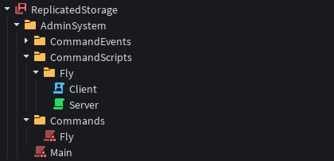
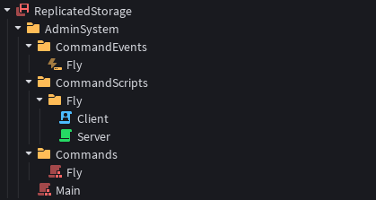

# Fly Command

This is an example basic fly command that allows the players to fly in the direction of their camera.

## The Design

We will create a command module, an event, and scripts to allow a certain player's character to fly in the game. We can begin by creating a new command module under the "Commands" folder in our admin system folder.


### Fly

```luau
-- Written by @TenebrisNoctua
-- Makes the given player fly.

--// Variables

local RunService = game:GetService("RunService")

local AdminModule = {
	Speed = 20, -- How fast a player will fly. (Studs per second)
	Flying = {} :: {[Instance]: {RBXScriptConnection}} -- Stores the currently flying players, and their connections.
}

--// Types

type TPlayer = {
	InputContexts: {
		Character: {
			Camera: InputAction,
			CameraPosition: InputAction,
			Move: InputAction,
			Jump: InputAction
		} & InputContext
	} & Folder
} & Player

--// Module Functions

-- This is the main command module function that when ran, allows the target player to fly.
function AdminModule.Begin(player: TPlayer)
	if not player:FindFirstChild("InputContexts") then return end
	if AdminModule.Flying[player] then return end -- We check if the player is already flying or not.

	local Character = player.Character
	if not Character then return end

	local HumanoidRootPart = Character:FindFirstChild("HumanoidRootPart") :: BasePart
	if not HumanoidRootPart then return end
	
	local AlignPosition: AlignPosition
	local AlignOrientation: AlignOrientation
	local CameraPosition: InputAction
	
    -- Here, we create the necessary instances that will allow the character to fly, if the module is ran on the server. These instances are used to align the player to a specific location at a specific orientation.
	if RunService:IsServer() then
		AlignPosition = Instance.new("AlignPosition")
		AlignPosition.ApplyAtCenterOfMass = true
		AlignPosition.Mode = Enum.PositionAlignmentMode.OneAttachment
		AlignPosition.Attachment0 = HumanoidRootPart:WaitForChild("RootAttachment") :: Attachment
		AlignPosition.Position = HumanoidRootPart.Position
		AlignPosition.Parent = HumanoidRootPart
	
		AlignOrientation = Instance.new("AlignOrientation")
		AlignOrientation.Mode = Enum.OrientationAlignmentMode.OneAttachment
		AlignOrientation.Attachment0 = HumanoidRootPart:WaitForChild("RootAttachment") :: Attachment
		AlignOrientation.Responsiveness = 50
		AlignOrientation.Parent = HumanoidRootPart
		
        -- Here, we create a new InputAction that captures the camera position of the client. The server will recieve and use this position to calculate the orientation of the character.
		CameraPosition = Instance.new("InputAction")
		CameraPosition.Type = Enum.InputActionType.Direction3D
		CameraPosition.Name = "CameraPosition"
		CameraPosition.Parent = player.InputContexts.Character
	else
        -- We do not need to create these instances on the client, as they will be replicated anyway. We just need to locate them.
		AlignPosition = HumanoidRootPart:FindFirstChild("AlignPosition") :: AlignPosition
		AlignOrientation = HumanoidRootPart:FindFirstChild("AlignOrientation") :: AlignOrientation
		CameraPosition = player.InputContexts.Character.CameraPosition
	end

	local CharacterContext = player.InputContexts.Character
	local Humanoid = Character:FindFirstChild("Humanoid") :: Humanoid
	Humanoid.PlatformStand = true
	
	local Connections = {}
	
	if RunService:IsClient() then
        -- This is used to send the current camera position to the server, so both the server and the client can use this data to calculate the correct orientation of the character.
		table.insert(Connections, RunService.RenderStepped:Connect(function(deltaTime: number)
			local CurrentCamera = game.Workspace.CurrentCamera
			if not CurrentCamera then return end
			CameraPosition:Fire(CurrentCamera.CFrame.Position)	
		end))
	end
	
	table.insert(Connections, RunService:BindToSimulation(function(deltaTime: number)
        -- Here, we get the camera position, and using it, calculate the target position and the orientation of the character.
        -- This function is bound to the simulation, and is ran on both the server and the client.
		local CameraPosition: Vector3 = CameraPosition:GetState()
		AlignPosition.Position = HumanoidRootPart.Position + ((HumanoidRootPart.Position - CameraPosition).Unit * AdminModule.Speed)
		AlignOrientation.CFrame = CFrame.lookAt(CameraPosition, HumanoidRootPart.Position)
	end))
	
	AdminModule.Flying[player] = Connections -- We add the player to the table to indicate that they're now flying.
end

-- This is the other main command module function that when ran, stops the target player from flying.
function AdminModule.End(player: TPlayer)
	local Connections = AdminModule.Flying[player]
	if not Connections then return end -- If the player is not flying, don't do anything.
	
	if RunService:IsClient() then
        -- The client does not need to destroy the instances due to replication.
        -- We just need to disconnect the events and clean-up.
		for _, connection in Connections do
			connection:Disconnect()
		end
		table.clear(Connections)
		AdminModule.Flying[player] = nil -- We remove the player from the table, now that they're no longer flying, on the client.
		return
	end

    -- The server will both destroy the created instances, and do the clean-up on its part.

	local Character = player.Character
	if not Character then player.CharacterAdded:Wait(); Character = player.Character end
	if not Character then return end
	
	local CharacterContext = player.InputContexts.Character

	local HumanoidRootPart = Character:FindFirstChild("HumanoidRootPart")
	local AlignPosition = HumanoidRootPart:FindFirstChild("AlignPosition")
	local AlignOrientation = HumanoidRootPart:FindFirstChild("AlignOrientation")
	local Humanoid = Character:FindFirstChild("Humanoid") :: Humanoid
	
	Humanoid.PlatformStand = false
	
	for _, connection in Connections do
		connection:Disconnect()
	end
	table.clear(Connections)
	
	AlignPosition:Destroy()
	AlignOrientation:Destroy()
	CharacterContext.CameraPosition:Destroy()

	AdminModule.Flying[player] = nil -- We remove the player from the table, now that they're no longer flying, on the server.
end

return AdminModule
```

Our simulation and main flying system code is now ready. Now, we need to create initializer scripts to run this code on both the Server and the Client. To achieve that, we can create two new `Script`s in the "CommandScripts" folder.



Before we move on to implementing the code for these `Script`s, we also need to create a new `RemoteEvent` that allows the client `Script` to know when to start the command module. We can create a new `RemoteEvent` for this under the "CommandEvents" folder.



Now that our events and other instances are set, we can start by implementing our Client `Script` which will start the command module once the "Fly" event has been fired.

### Client

```luau
-- Written by @TenebrisNoctua
-- Handles the relevant command event.

--// Variables

local ReplicatedStorage = game:GetService("ReplicatedStorage")
local Players = game:GetService("Players")
local StarterPlayer = game:GetService("StarterPlayer")

local PlayerModule = require(StarterPlayer:WaitForChild("PlayerModule"))
local Controls = PlayerModule:GetControls()

local AdminSystem = ReplicatedStorage.AdminSystem
local CommandEvents = AdminSystem.CommandEvents

local FlyCommand = require(AdminSystem.Main).Fly
local FlyEvent = CommandEvents.Fly

--// Event Handler

-- This event will be fired with a string that allows the client to know which operation to perform.
FlyEvent.OnClientEvent:Connect(function(state: string)
	if not Players.LocalPlayer then return end
	if not FlyCommand then return end
	if state == "Begin" then -- If the state is "Begin", then begin the simulation.
		Controls:Enable(false) -- We disable the player controls here to make sure it doesn't conflict with our system.
		FlyCommand.Begin(Players.LocalPlayer :: any) -- Our main command module function that begins the simulation.
	elseif state == "End" then -- If the state is "End", then end the simulation.
		if not FlyCommand.End then return end
		FlyCommand.End(Players.LocalPlayer :: any) -- Our other main command module function that ends the simulation.
		Controls:Enable(true) -- We enable the player controls afterwards so the player can move normally again.
	end
end)
```

We are almost done! All we need to do is to implement the code that will run the command module on the Server as well.

### Server

```luau
-- Written by @TenebrisNoctua
-- Handles the relevant command system.

--// Variables

local ReplicatedStorage = game:GetService("ReplicatedStorage")
local Players = game:GetService("Players")

local AdminSystem = ReplicatedStorage.AdminSystem
local CommandEvents = AdminSystem.CommandEvents

local FlyCommand = require(AdminSystem.Main).Fly
local FlyEvent = CommandEvents.Fly

--// Local Function

-- This function runs when a player has joined the server.
local function onPlayerAdded(player: Player)
	if not FlyCommand then return end	
	player.CharacterAdded:Wait() -- We wait until the player has a character.
	
	FlyCommand.Begin(player) -- We begin the simulation for the player on the server.
	FlyEvent:FireClient(player, "Begin") -- Then, we send the signal to the client to begin with its own simulation.
	
	task.wait(10) -- Waiting 10 seconds to allow the player to test the feature.
	if not FlyCommand.End then return end
	FlyCommand.End(player) -- We end the simulation for the player on the server.
	FlyEvent:FireClient(player, "End") -- Then, we send the signal to the client to stop with its own simulation.
end

-- This exists just in-case if the below event does not fire.
for _, player in Players:GetPlayers() do
	onPlayerAdded(player)
end

--// Event Handler

Players.PlayerAdded:Connect(onPlayerAdded)
```

And that's all! Hitting the "Play" button should allow you to test our new admin command. You are free to change the Server code as much as you like, to implement an input-based system where player can press certain keys to start or stop flying.
