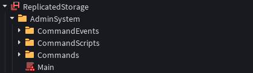

# Basic Admin System

This is an example basic admin system that you can create and use with Server Authority.

## The Design

We will create a simple modular admin system, that contains some also simple command modules which allows the player to commit certain actions in the game. We can begin by creating a folder in `ReplicatedStorage`, which both the Server and the Client can access.

Next, we will create these instances:

* "CommandEvents" `Folder`: This will hold our events which will allow the Server and the Client to communicate for the command modules. Such as when the command has been ran on the Server, the Server will fire an event which will tell the Client to also run the command.

* "CommandScripts" `Folder`: This will hold our Server and Client scripts which will run the command modules. You can edit these in any way you wish to customize the behavior of when and how will the command be ran.

* "Commands" `Folder`: This will hold our main command modules which will contain our simulation code for running the command. These modules will be ran on both the Server and the Client.

* "Main" `ModuleScript`: This is a module which essentially requires all the command modules and puts them in a simple API for usage. Instead of requiring each and individual command module, one can simply require this module and access the functions and data of all command modules through it. However, this module is purely for ease of use, and not necessary. You can also require the modules individually if you wish to customize that behavior, too.

We have now set-up our main admin system. We can now begin adding our command modules and scripts. You can check out the basic command tutorial pages on the left side, to see how you can implement them.