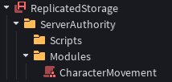
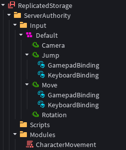
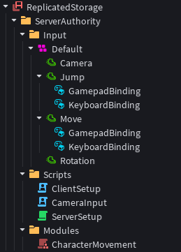
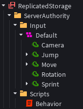
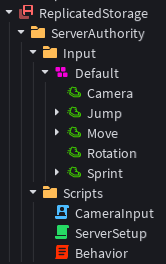

# Character Movement System

This is an example character movement system that you can create with Server Authority.

!!! failure "Deprecated"
	In the newer versions, Server Authority comes with an updated `PlayerModule` that does and supports everything mentioned in this tutorial. This tutorial will continue to exist as an example, however.

## The Design

In a server-authoritative model, the same code must run on both the Server and the Client. This is how the client predicts what the server will do. To achieve this, we have two options: We can use `ModuleScript`s to do it in a modular way, or we can use the new `AuroraScript` object to do it all in one script architecture.

## Default (Modular) Way

First, under the "ServerAuthority" folder in `ReplicatedStorage`, we create a `ModuleScript` named "CharacterMovement". This will be our main module which will contain the movement system. It will be used both by the server and the client.

The hierarchy should look like this:



Then, in this module, we bind our movement function to the simulation using the `RunService:BindToSimulation(callback: (deltaTime: number) -> ())` method with a callback function.

### CharacterMovement

```luau
local RunService = game:GetService("RunService")

local MovementModule = {
	Connections = {} :: {RBXScriptConnection}
}

 -- This function begins the movement calculation for a player.
function MovementModule.BeginMovement(player: Player)
	-- We bind our function to the simulation using RunService, and add the Connection object to the Connections table to track it.
	MovementModule.Connections[player] = RunService:BindToSimulation(function(deltaTime: number)
        -- This will be the function to start calculating the movement of a player's character in.
	end)
end

-- This function stops the movement calculation for a player.
function MovementModule.EndMovement(player: Player) 
	local FoundConnection: RBXScriptConnection? = MovementModule.Connections[player]
	if not FoundConnection then return end
	
	FoundConnection:Disconnect()
	MovementModule.Connections[player] = nil
end

return MovementModule
```

We now have a simple initial system that allows us to connect to the `.FixedHeartbeat` signal. Before we continue to write the actual calculation system however, we need to create some new `Instance`s to get the input from the player.

To do this, we create another folder called "Input" and create an `InputContext` with certain `InputAction`s parented to it, allowing us to get movement input from the player's client.

We will create 4 `InputAction`s under this `InputContext`, called: "Camera", "Jump", "Move", "Rotation".
To support both gamepad and keyboard input, we create two `InputBinding`s under the "Jump" and "Move" `InputAction`s.

For the "Jump" `InputAction` (`Bool` Type), we will add the `Space` KeyCode to first `InputBinding`, called "KeyboardBinding". And for the next one, which we can call "GamepadBinding", we add the `ButtonA` KeyCode.

For the "Move" `InputAction` (`Direction2D` Type), we will add 4 directions to the first `InputBinding` meant for keyboard, called "KeyboardBinding":

* Down: `S`
* Up: `W`
* Left: `A`
* Right: `D`

For the next `InputBinding`, called "GamepadBinding", we will set the KeyCode to `Thumbstick 1`.

The hierarchy should now look like this:



We will be cloning this input system to the player object with a script later.

We can now move on to creating the actual system which will calculate the movement for the character.

### CharacterMovement

```luau
local RunService = game:GetService("RunService")

local MovementModule = {
	Connections = {} :: {RBXScriptConnection}
}

 -- This is the function that begins the movement calculation for a player.
function MovementModule.BeginMovement(player: Player)
	-- We bind our function to the simulation using RunService, and add the Connection object to the Connections table to track it.
	MovementModule.Connections[player] = RunService:BindToSimulation(function(deltaTime: number)
		if not player.Character then return end -- If the character has not loaded yet, return.
		
		local Character = player.Character
		local Humanoid: Humanoid = Character.Humanoid 
		local Input: InputContext = player.Input.Default
		
		local MoveInput: InputAction = Input.Move
		local CameraInput: InputAction = Input.Camera
		local RotationInput: InputAction = Input.Rotation
		local JumpInput: InputAction = Input.Jump
		
		-- Getting the values from InputActions. We use :GetState() here instead of .StateChanged.
		local MoveVector2D: Vector2 = MoveInput:GetState() 
		local CameraVector2D: Vector2 = CameraInput:GetState()
		local RotationIsCameraRelative: boolean = RotationInput:GetState()
		local JumpBoolean: boolean = JumpInput:GetState()
		
		-- Calculating the move direction based on camera and movement input.
		local CameraVector3D = Vector3.new(CameraVector2D.X, 0, CameraVector2D.Y)
		local RightVector = CameraVector3D:Cross(Vector3.yAxis)

		local MoveVector = CameraVector3D * MoveVector2D.Y + RightVector * MoveVector2D.X
		local MoveDirection = Vector3.new(MoveVector.X, 0, MoveVector.Z)
		
		-- Moving the Humanoid to the target move direction.
		Humanoid:Move(MoveDirection)
		
		-- Rotating the Character based on camera direction.
		if RotationIsCameraRelative then
			Humanoid.AutoRotate = false
			if not Humanoid.SeatPart and Humanoid.RootPart then
				Humanoid.RootPart.CFrame = CFrame.new(Humanoid.RootPart.CFrame.Position, Humanoid.RootPart.CFrame.Position + CameraVector3D)
			end
		else
			Humanoid.AutoRotate = true
		end
		
		-- Allowing the Character to jump based on input, and if it's not currently in-air.
		local currentState = Humanoid:GetState()
		local isInAir = currentState == Enum.HumanoidStateType.FallingDown
			or currentState == Enum.HumanoidStateType.Freefall
			or currentState == Enum.HumanoidStateType.Jumping

		if not isInAir and JumpBoolean then
			Humanoid:ChangeState(Enum.HumanoidStateType.Jumping)
		end
	end)
end

-- This function stops the movement calculation for a player.
function MovementModule.EndMovement(player: Player) 
	local FoundConnection: RBXScriptConnection? = MovementModule.Connections[player]
	if not FoundConnection then return end
	
	FoundConnection:Disconnect()
	MovementModule.Connections[player] = nil
end

return MovementModule
```

Our system is almost ready! Now, for the system to start working, we need to initialize and run this module from both the server and the client. And we also need to clone and parent the "Input" folder we created above to the player, so the system can start capturing input from the client.

### ServerSetup

```luau
local Players = game:GetService("Players")
local ReplicatedStorage = game:GetService("ReplicatedStorage")

local ServerAuthority = ReplicatedStorage.ServerAuthority
local Modules = ServerAuthority.Modules
local Input = ServerAuthority.Input

local CharacterMovement = require(Modules.CharacterMovement)

-- This function sets the streaming mode for the character model to Atomic upon character load.
local function InitializeCharacter(character: Model)
	character.ModelStreamingMode = Enum.ModelStreamingMode.Atomic
end

-- This function clones and parents the Input folder to the player to start capturing input, and begins the movement calculation.
local function InitializePlayer(player: Player)
	if player.Character then InitializeCharacter(player.Character) end
	player.CharacterAdded:Connect(InitializeCharacter)
	
	local InputTemplate = Input:Clone()
	InputTemplate.Parent = player
	
	CharacterMovement.BeginMovement(player)
end

-- This function initializes the above functions for all existing players, or new players.
local function Initialize()
	for _, player in Players:GetPlayers() do
		InitializePlayer(player)
	end
	Players.PlayerAdded:Connect(InitializePlayer)
end

-- We want to only run the above systems when the AuthorityMode is set to Server. Automatic results in inconsistent behavior.
if workspace.AuthorityMode == Enum.AuthorityMode.Server then
	Initialize()
end
```

This is our server script that initializes the movement calculation and input parenting for a player. This is our main system that allows the player to move.

### ClientSetup

```luau
local Players = game:GetService("Players")
local ReplicatedStorage = game:GetService("ReplicatedStorage")

local ServerAuthority = ReplicatedStorage.ServerAuthority
local Modules = ServerAuthority.Modules

local CharacterMovement = require(Modules.CharacterMovement)
local LocalPlayer = Players.LocalPlayer

-- This function begins the client prediction for the character.
local function InitializeCharacter(character: Model)
	local HumanoidRootPart: Part = character:WaitForChild("HumanoidRootPart")
	HumanoidRootPart:SetPredictionMode(Enum.PredictionMode.On)
end

-- This function initializes the movement prediction and the character.
local function Initialize()
	if LocalPlayer.Character then InitializeCharacter(LocalPlayer.Character) end
	LocalPlayer.CharacterAdded:Connect(InitializeCharacter)
	
	CharacterMovement.BeginMovement(LocalPlayer)
end

-- We want to only run the above systems when the AuthorityMode is set to Server. Automatic results in inconsistent behavior.
if workspace.AuthorityMode == Enum.AuthorityMode.Server then
	Initialize()
end
```

This is our client script that initializes the movement prediction for a player. This is our main system that allows a smooth experience for the player movement.

However, we also need to create another client script to capture input for the camera:

### CameraInput

```luau
local Players = game:GetService("Players")
local RunService = game:GetService("RunService")
local UserGameSetting = UserSettings():GetService("UserGameSettings")

local LocalPlayer = Players.LocalPlayer

-- Defining the InputActions for the camera and rotation.
local Input = LocalPlayer:WaitForChild("Input")
local CameraInput: InputAction = Input.Default.Camera
local RotationInput: InputAction = Input.Default.Rotation

if workspace.AuthorityMode == Enum.AuthorityMode.Server then
	-- This callback function calculates the current rotation of the character and the camera, and sends it to the server.
	RunService:BindToRenderStep("CameraInput", Enum.RenderPriority.Last.Value, function()
		local Camera = workspace.CurrentCamera
		local YAxis: Vector3 = Vector3.yAxis
		local Forward = YAxis:Cross(Camera.CFrame.RightVector)
		
		CameraInput:Fire(Vector2.new(Forward.X, Forward.Z))
		RotationInput:Fire(UserGameSetting.RotationType == Enum.RotationType.CameraRelative)
	end)
end
```

After everything above has been complete, our new system hierarchy should now look like this:



And that's all! Hitting the "Play" button should allow you to test our new system. This new character system provides a secure and accurate character simulation, while behaving smoothly for the player's view.

-----

## Behavior Way

While the modular system works, it is not fully desirable as it requires us to create loaders from both the server and the client, and a module script which runs the movement system. To make make it more desirable and easier for us to create Server Authority systems, there exists a new `Instance` called `AuroraScript`. This new instance allows us to define a behavior which will both run on the server and the client.

To learn more about Behaviors, check out the [Behaviors](../main/aurora.md) section.

First we create a new `AuroraScript` called "CharacterMovement". This will be our main script which will contain the movement system.

### CharacterMovement

```luau
local RunService = game:GetService("RunService")
local Players = game:GetService("Players")

type AuroraScriptObject = {
	Instance: Instance,
	Frame: number,
	LODLevel: number,
	Connect: (self: AuroraScriptObject, signal: RBXScriptSignal, functionName: string) -> RBXScriptConnection,
	Subscribe: (self: AuroraScriptObject, topic: string, functionName: string) -> string,
	Publish: (self: AuroraScriptObject, topic: string, ...any) -> any,
	SendMessage: (self: AuroraScriptObject, boundInstance: Instance, behaviorName: string, functionName: string, ...any) -> ...any,
	Delay: (self: AuroraScriptObject, amount: number, functionName: string) -> string,
	SetMaxFrequency: (self: AuroraScriptObject, frequency: number) -> number,
	[string]: any
}

-- This function runs when the Behavior starts.
function Behavior.OnStart(self: AuroraScriptObject)
	-- We bind the DefaultMovement method of the Behavior to the Simulation.
	RunService:BindToSimulation(function(deltaTime: number) 
		self:DefaultMovement(deltaTime)
	end)
	self.Player = Players:GetPlayerFromCharacter(self.Instance) -- We find the Player from the bound Character instance and set it as a value within our Behavior.
end

function Behavior.DefaultMovement(self: AuroraScriptObject, deltaTime: number)
	-- This function runs when BindToSimulation calls it with the deltaTime argument.
end

-- We declare a field in our Behavior to store the Player instance.
Behavior.DeclareField("Player", {Type = "instance"})
```

We now have a simple initial system that allows us to bind our method to the simulation and set our Player property.

However, just like in the modular way, we need to create an input system to capture input from the client.
Repeating the steps from [Modular Way](#default-modular-way), we now have a hierarchy like this:



We can now move on to creating the actual system which will calculate the movement for the character.

### CharacterMovement

```luau
local RunService = game:GetService("RunService")
local Players = game:GetService("Players")

type AuroraScriptObject = {
	Instance: Instance,
	Frame: number,
	LODLevel: number,
	Connect: (self: AuroraScriptObject, signal: RBXScriptSignal, functionName: string) -> RBXScriptConnection,
	Subscribe: (self: AuroraScriptObject, topic: string, functionName: string) -> string,
	Publish: (self: AuroraScriptObject, topic: string, ...any) -> any,
	SendMessage: (self: AuroraScriptObject, boundInstance: Instance, behaviorName: string, functionName: string, ...any) -> ...any,
	Delay: (self: AuroraScriptObject, amount: number, functionName: string) -> string,
	SetMaxFrequency: (self: AuroraScriptObject, frequency: number) -> number,
	[string]: any
}

-- This function runs when the Behavior starts.
function Behavior.OnStart(self: AuroraScriptObject)
	-- We bind the DefaultMovement method of the Behavior to the Simulation.
	RunService:BindToSimulation(function(deltaTime: number) 
		self:DefaultMovement(deltaTime)
	end)
	self.Player = Players:GetPlayerFromCharacter(self.Instance) -- We find the Player from the bound Character instance and set it as a value within our Behavior.
end

function Behavior.DefaultMovement(self: AuroraScriptObject, deltaTime: number)
	-- This function runs when BindToSimulation calls it with the deltaTime argument.

	local Character: Model = self.Instance
	local Player: Player = self.Player
	if not Player then return end
	
	local Humanoid: Humanoid = Character.Humanoid
	if not Humanoid then return end

	local Input: InputContext = Player.Input.Default
		
	local MoveInput: InputAction = Input.Move
	local CameraInput: InputAction = Input.Camera
	local RotationInput: InputAction = Input.Rotation
	local JumpInput: InputAction = Input.Jump
	
	-- Getting the values from InputActions. We use :GetState() here instead of .StateChanged.
	local MoveVector2D: Vector2 = MoveInput:GetState() 
	local CameraVector2D: Vector2 = CameraInput:GetState()
	local RotationIsCameraRelative: boolean = RotationInput:GetState()
	local JumpBoolean: boolean = JumpInput:GetState()
	
	-- Calculating the move direction based on camera and movement input.
	local CameraVector3D = Vector3.new(CameraVector2D.X, 0, CameraVector2D.Y)
	local RightVector = CameraVector3D:Cross(Vector3.yAxis)
	
	local MoveVector = CameraVector3D * MoveVector2D.Y + RightVector * MoveVector2D.X
	local MoveDirection = Vector3.new(MoveVector.X, 0, MoveVector.Z)
	
	-- Moving the Humanoid to the target move direction.
	Humanoid:Move(MoveDirection)
	
	-- Rotating the Character based on camera direction.
	if RotationIsCameraRelative then
		Humanoid.AutoRotate = false
		if not Humanoid.SeatPart and Humanoid.RootPart then
			Humanoid.RootPart.CFrame = CFrame.new(Humanoid.RootPart.CFrame.Position, Humanoid.RootPart.CFrame.Position + CameraVector3D)
		end
	else
		Humanoid.AutoRotate = true
	end
	
	-- Allowing the Character to jump based on input, and if it's not currently in-air.
	local currentState = Humanoid:GetState()
	local isInAir = currentState == Enum.HumanoidStateType.FallingDown
		or currentState == Enum.HumanoidStateType.Freefall
		or currentState == Enum.HumanoidStateType.Jumping
	if not isInAir and JumpBoolean then
		Humanoid:ChangeState(Enum.HumanoidStateType.Jumping)
	end
end

-- We declare a field in our Behavior to store the Player instance.
Behavior.DeclareField("Player", {Type = "instance"})
```

Our behavior is now done! This behavior will now run when it has been bound to a player's character. To do this however, we need to manually bind it upon character load on the server. For this, we can add a `Script` called "ServerSetup".

### ServerSetup

```luau
local Players = game:GetService("Players")
local ReplicatedStorage = game:GetService("ReplicatedStorage")

local ServerAuthority = ReplicatedStorage.ServerAuthority
local Scripts = ServerAuthority.Scripts
local Input = ServerAuthority.Input

-- This function sets the streaming mode for the character model to Atomic, and binds the character to the behavior upon load.
local function InitializeCharacter(character: Model)
	character.ModelStreamingMode = Enum.ModelStreamingMode.Atomic
	Scripts.Behavior:AddTo(character)
end

-- This function clones and parents the Input folder to the player to start capturing input.
local function InitializePlayer(player: Player)
	if player.Character then InitializeCharacter(player.Character) end
	player.CharacterAdded:Connect(InitializeCharacter)

	local InputTemplate = Input:Clone()
	InputTemplate.Parent = player
end

-- This function initializes the above functions for all existing players, or new players.
local function Initialize()
	for _, player in Players:GetPlayers() do
		InitializePlayer(player)
	end
	Players.PlayerAdded:Connect(InitializePlayer)
end

-- We want to only run the above systems when the AuthorityMode is set to Server. Automatic results in inconsistent behavior.
if workspace.AuthorityMode == Enum.AuthorityMode.Server then
	Initialize()
end
```

This is our server script that parents the Input folder to a player, and binds the behavior to its character when it loads.

With this system, the character can now move, however, we still need to create a client `Script` to capture input for the camera:

### CameraInput

```luau
local Players = game:GetService("Players")
local RunService = game:GetService("RunService")
local UserGameSetting = UserSettings():GetService("UserGameSettings")

local LocalPlayer = Players.LocalPlayer

-- Defining the InputActions for the camera and rotation.
local Input = LocalPlayer:WaitForChild("Input")
local CameraInput: InputAction = Input.Default.Camera
local RotationInput: InputAction = Input.Default.Rotation

if workspace.AuthorityMode == Enum.AuthorityMode.Server then
	-- This callback function calculates the current rotation of the character and the camera, and sends it to the server.
	RunService:BindToRenderStep("CameraInput", Enum.RenderPriority.Last.Value, function()
		local Camera = workspace.CurrentCamera
		local YAxis: Vector3 = Vector3.yAxis
		local Forward = YAxis:Cross(Camera.CFrame.RightVector)
		
		CameraInput:Fire(Vector2.new(Forward.X, Forward.Z))
		RotationInput:Fire(UserGameSetting.RotationType == Enum.RotationType.CameraRelative)
	end)
end
```

After everything above has been complete, our new system hierarchy should now look like this:



And that's all! Hitting the "Test" button should allow you to test our new system. This new character system provides a secure and accurate character simulation, while behaving smoothly for the player's view.