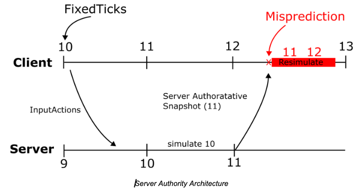

# Getting Started

Hello. This is a detailed documentation about the new server authority system that Roblox has showcased recently.
It is a new system aiming to achieve a better physics simulation, while also providing better security. 
This documentation will try to give you almost all of the available information about this new system. However, not all information may be accurate, as this system is still a work-in-progress.

With all that being said, this documentation may recieve updates whenever there's a new feature added, or a feature removed. If you want to stay up-to-date, make sure to visit this documentation again later, and if you have any additional information that you can provide about this system, let me know with a message on my [Twitter](https://twitter.com/TenebrisNoctua).

Let's begin.

-----

# How to Access?

The simplest way you can gain access to the new features, is through enrolling to the Early Access Program for the Server Authority Core API.
You can send a reply to this [thread](https://devforum.roblox.com/t/early-access-server-authority/3983188) to apply for the program. 

If you're accepted, go to your [account settings](https://www.roblox.com/my/account), and scroll down to the "Early Access Programs" section.
Then, select the *"Early Access: Server Authority Core API Early Access"* program. This will now enroll you to the program, and by following the steps below, you can access the features.

## If using vanilla Studio

Restart your Studio. Upon the restart, there will be an "Update Studio" button on the top right. Clicking this button will automatically update your Studio and install the version meant for the program. After this, you should be good to go.

## If using a custom bootstrapper

If your custom bootstrapper application to launch Studio does not have a built-in system for automatically opening the version meant for the early access program, then follow the steps below.

Go to your [creator page](https://create.roblox.com). And re-download the Studio application. After install, it should automatically open. Click on the "Update Studio" button on the top right. This will automatically update your Studio and install the version meant for the program.
After this, you should be good to go.

Do not forget to launch the Studio application through the versions folder for the installed Studio application. Using your custom bootstrapper may not work.

You must also repeat these steps if you wish to roll-out of the program.

-----

# What is Server Authority?

Server Authority is when the server becomes the only source of truth for game actions, logic and data in your world.

In this model, clients can no longer hold network ownership of any instances. This ensures the trusted data replicated from the client to the server is kept at a minimum. The only trusted data that the server recieves from the clients are their inputs, which is used to simulate their characters or systems controlled by them. This results in a far more secure model, which reduces or outright removes many problems that have arisen from giving clients network ownership of certain parts and systems in your world. 

## How does this effect the physics around my world?

Server Authority completely changes the behavior of all unanchored `Part`s in the `Workspace`. Before; the physics calculation of a `Part` was handled by both the server and the clients in a place. When a client came close to a `Part`, the network ownership would automatically shift from the server to the client, so the client could take the burden of calculating the physics for that `Part`.

A similar case was also in effect for the characters too. Before, because of network ownership, the client had full control over their character. This allowed them to change certain properties of their character such as velocity, position, rotation, and many others to their liking. This of course, caused many security issues. Using exploits, the client would be able to give themselves an unfair advantage in gameplay by changing these properties. This gave the rise of many exploiting issues such as speed-hacking, fly-hacking, no-clipping, teleporting, and many others inside popular places on the platform.

The issues are not only limited to exploiting. In many competitive games, such as racing, the cars would most of the time be misaligned, or their position would constantly jitter, or look very different. That is because of client calculated physics of the previous system. Because the network ownership of each car is set to each client, rather than the server, the car positions would end up different than expected.

However, with Server Authority, most of these issues, if not all of them, are automatically resolved.

For the case of the character, where a client would modify their character to gain an unfair advantage such as speedhacking, would no longer be possible, as the client no longer holds ownership of their character, and all that is given to the server are inputs.

For the case of the racing games, since the server now calculates the positions of the cars, they now move more consistently. Maneuvers, drifts, hits become more accurate, and the system works as smooth as possible.

-----

# The Problem with Server Authority

For the reasons I've given above, Server Authority sounds amazing, it improves accuracy, increases security and overall produces a better experience for players, right? Not exactly.

Server Authority on its own is horrible for player experience. This is simply due to the fact that players are from all around the world, where they might be hundereds, if not thousands of miles away from the nearest server. This distance means their ping will be high, which means the time it will take for a player's input to reach the server will also be high. This creates a choppy, very uncomfortable experience where a player might only start seeing their character move after a long time has passed since they sent their input. Imagine pressing the "W" key and only seeing your character move after a second or two. It would make it incredibly hard to play a game, if not outright impossible for some players.

Luckily, there is a solution that exists which solves these problems. This solution has existed for a very long time, and many competitive games out there already use it. It is called "Rollback Netcode".

-----

# What is Rollback Netcode?

Unfortunately, I cannot give you an in-depth explanation on what Rollback Netcode is, as it is a relatively complex concept, and I do not wish to fill this documentation with every detail of it. By doing a small bit of research, you can find some really good articles on it, such as [this one](https://www.gabrielgambetta.com/client-server-game-architecture.html), on the web to learn more. I will give you a short summary on what the concept is however, so rest assured.

This concept is when the client also simulates its own input alongside the server, but just a little bit ahead of it. For the inputs to feel responsive and smooth, the client immediately simulates them when they are given, while sending them to the server. Since the server is the authority here, this simulation doesn't hold an important value, and is purely done for the visuals, so we call them "prediction"s. Essentially, the client "predicts" how their inputs will effect the game state (e.g, their character), while the server determines how their inputs will actually effect the game state.

However, there might be times where the client prediction and the actual simulation results may differ from each other. For example, assuming T is the current time, the client has made a prediction at T-3, and when the authoritative update arrives for T-3 from the server, the client notices its prediction and the authoritative update results are different from each other. This is called a "Misprediction". In this case, the client rolls back to the authoritative update frame by reverting its current state and time. Then, the client resimulates automatically after rollback to speed back to its current predicted frame. The number of frames to resimulate is based on the latency between the client and the server. The client tries to stay far enough ahead of the server so that its own inputs arrive on the server just in time to be processed on the frame the player intended to perform them.

Mispredictions are normal and expected. They should be small and the resulting correction should be imperceptible to clients.

!!! example
    Your client thinks you’ve moved forward. However, the server registered that you were hit by a stun grenade and can’t move for a few  seconds. The client and server now have different states.

Like I have mentioned above, this divergence is called a misprediction. It can occur for several reasons: the network latency has shifted, other players acted in ways the client didn’t anticipate, the experience runs certain logic exclusively on the server, etc. While you can't prevent every misprediction, you can keep gameplay feeling smooth and responsive by using the right techniques.

!!! example 
    Let’s say there is 100ms of latency between the client and server, and the experience is a 60Hz game.

Each frame is 1/60s (or 16.67ms). Since 100ms of latency is equivalent to ~6 frames (100 ms divided by 16.67 ms/frame), we know the client will be 6 frames ahead of the server. This means that, when the client detects it made a misprediction, it will rollback to the server's state and then resimulate frames ahead. In general, the player should hardly notice this.

-----

# The Input Action System

The Input Action System (IAS) is a major part of the server authority system. It allows you to reliably transfer inputs from client to the server, while allowing you to customize them easily. I will not be explaining this system and how it works however. You can check out the main post talking about it through [here](https://devforum.roblox.com/t/client-beta-input-action-system-is-now-available-to-publish-in-experiences/3890979).

Player inputs like joystick movement and button presses are sent from client to server using [`InputAction`](https://create.roblox.com/docs/reference/engine/classes/InputAction)s. You have to use `InputAction` for all inputs that affect the core game simulation, because they are the only client authoritative data in the core rollback system.

You can send any continuous stream of data from the client to server using this API, and the server will trust what the client has sent. It is up to you to validate that the clients have sent legitimate inputs. Be sure to enforce maximum and minimum ranges on numbers sent from the client, just like how you would validate values sent from remotes.

!!! note 
    The server will automatically ignore input data from the client if it arrives far too late or far too early, which can happen if there are sudden changes in a client's network conditions.

-----